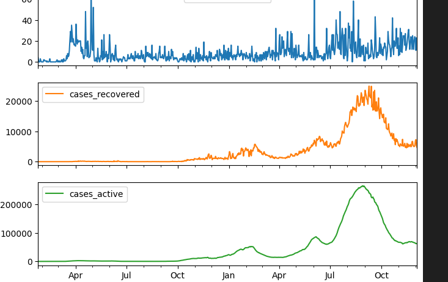

## COVID-19 Time Series Analysis

#### Description

This project analyzes COVID-19 data over time to predict the daily COVID cases to determine if travel bans should be imposed or rescined. It includeds data cleaning,visualization, predictive modeling using LSTM Neural Network.The goal is to predict new cases in Malaysia using the past 30 days of number of cases.

