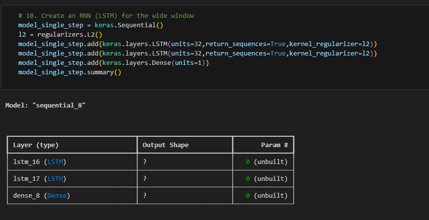
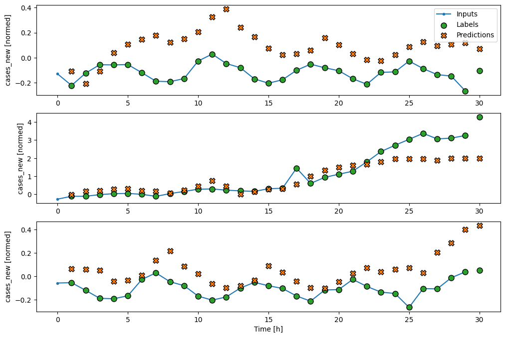
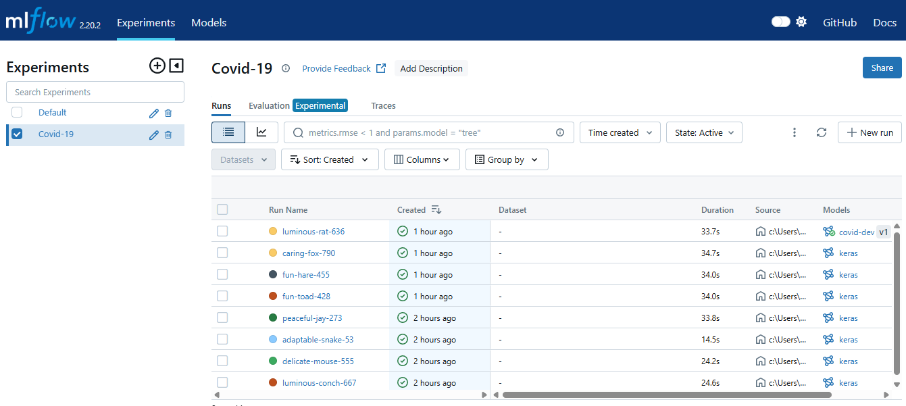
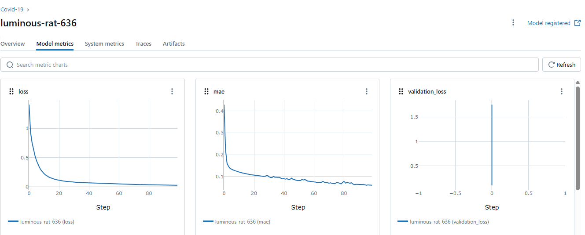

# COVID-19 Prediction Using LSTM

## Overview
The year 2020 marked a catastrophic event in human history with the outbreak of the COVID-19 pandemic. The virus spread globally, leading to significant health and economic crises. Many governments imposed travel restrictions, quarantines, social distancing, and lockdowns to mitigate the spread. However, a lack of an AI-assisted automated tracking and prediction system hindered efforts to control the outbreak effectively.

This project aims to develop a deep learning model using Long Short-Term Memory (LSTM) neural networks to predict daily COVID-19 cases in Malaysia based on the past 30 days of reported cases. The goal is to assist in decision-making regarding travel bans and other preventive measures.

## Dataset
The dataset consists of daily reported COVID-19 cases in Malaysia. It includes:
- Date-wise new cases
- Data spanning from early 2020 to the latest available date

## Model
The project employs an LSTM neural network, which is well-suited for time-series forecasting. The model architecture includes:
- LSTM layers for sequential data processing
- Dropout layers to prevent overfitting
- Dense layers for final predictions




## Requirements
To run this project, install the following dependencies:
```bash
pip install tensorflow numpy pandas matplotlib scikit-learn
```

## Usage
1. Clone the repository:
   ```bash
   git clone https://github.com/your-username/covid19-lstm-prediction.git
   ```
2. Navigate to the project folder:
   ```bash
   cd covid19-lstm-prediction
   ```
3. Run the Jupyter Notebook:
   ```bash
   jupyter notebook Project_1.ipynb
   ```

## Results
The model generates predictions for daily new cases and provides visualizations comparing predicted vs actual cases. These insights can assist authorities in making data-driven decisions for pandemic control.



## MLflow

Mlflow Main Pages


Mlflow model


## Future Improvements
- Integration with real-time COVID-19 data sources
- Hyperparameter tuning for improved accuracy
- Deployment as a web application for accessibility

## Contributors
- [Data Source](https://github.com/MoH-Malaysia/covid19-public)

## License
This project is licensed under the MIT License.


